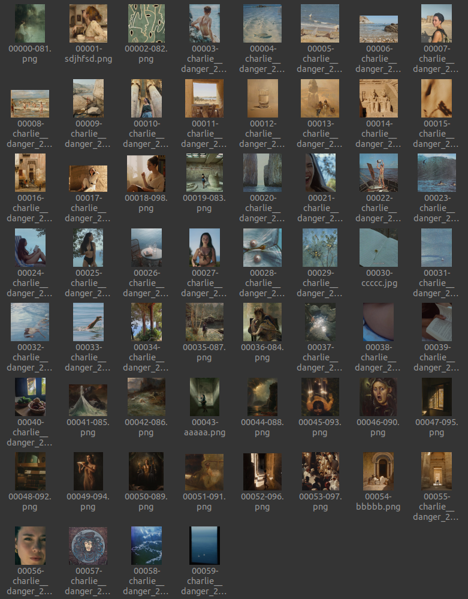

# Instagram Feed Creator

A program which sort your images by color in order to create a gradient, for an instagram feed for example.

The program will takes all of the images, **jpg and png only** into the root directory, sort them and copy the files into the `sorted` directory. The sorted files will have an ID before its names to keep the sort. For example if you have two images named `my_beautiful_photo.png` and `landscape.jpg` the renamed files will be : `00000-my_beautiful_photo.png` and `00001-landscape.jpg`

## How to use it

`python3 main.py make_feed`

## Need more information ?

I wrote an article which detailled how the program works here (french) : [Créer un dégrade d'image : un vrai défi](https://nathan-out.github.io/posts/creer-un-degrade-dimage-un-vrai-defi/). It details some of the basic issues concerning colour sorting, treatment of dominant colours etc. and can be a means for better understanding of the program.

## Output

There is en example of result :

